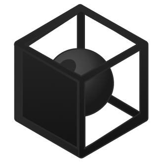
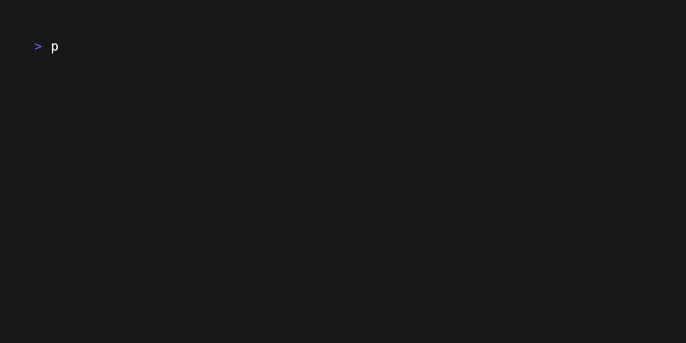

<div align="center">

<picture>
  <source media="(prefers-color-scheme: dark)" srcset="assets/logo-dark-mode.png" />
  <source media="(prefers-color-scheme: light)" srcset="assets/logo-light-mode.png" />
  
</picture>

# `Capsule` Bash


[Getting Started](#getting-started) • [Documentation](#documentation) • [Issues](https://github.com/capsulerun/bash/issues/new) • [Contributing](#contributing)


</div>

## Overview

`Capsule` Bash is a command interpreter built for executing untrusted commands. It provides a bash-like interface to interact with the filesystem and run commands in a sandboxed environment.

- **Commands and sandboxes**: Bash commands are reimplemented in TypeScript and run code inside isolated sandboxes. The sandbox layer is modular, so we can plug in any runtime that implements the interface. The default `WasmRuntime` uses [Capsule](https://github.com/capsulerun/capsule) to run commands inside WebAssembly sandboxes.

- **Instant feedback**: Traditional bash treats silence as success. In agentic workflows for example, that forces a second call just to confirm the first one worked. Capsule Bash returns structured output for every command. Exit code, stdout, stderr, and a diff of filesystem changes.

- **Workspace isolation**: Commands operates in a mounted workspace directory. The host filesystem is not accessible from inside the sandbox. You get full visibility into what is executed without exposing your system. The workspace is persistent and stays alive until you reset it manually.

## Getting Started

### TypeScript SDK

```bash
npm install @capsule-run/bash @capsule-run/bash-wasm
```

Run it:

```typescript
import { Bash } from "@capsule-run/bash";
import { WasmRuntime } from "@capsule-run/bash-wasm";

const bash = new Bash({ runtime: new WasmRuntime() });

const result = await bash.run("mkdir src && touch src/index.ts");

console.log(result);

/**
Result {
  stdout: "Folder created ✔\nFile created ✔",
  stderr: "",
  diff: { created: ['src/index.ts'], modified: [], deleted: [] },
  duration: 10,
  exitCode: 0,
}
**/
```
### Interactive shell

Clone the repository, then run from the project root:

```bash
pnpm -s bash-wasm-shell
```

> [!IMPORTANT]
> Python and pip are required to compile the Python sandbox. Both sandboxes (JS and Python) are needed to run the shell.

### MCP server

```json
{
  "mcpServers": {
    "capsule": {
      "command": "npx",
      "args": ["-y", "@capsule-run/bash-mcp"]
    }
  }
}
```

See the [MCP Readme](packages/bash-mcp) for configuration details.

## Documentation

### Bash Options

| Parameter | Description | Type | Default |
|-----------|-------------|------|---------|
| `runtime` | Runtime to use for the sandbox | `Runtime class` | None |
| `customCommands` | Custom commands to add to the bash instance | `CustomCommand[]` | `[]` |
| `hostWorkspace` | Host workspace directory | `string` | `".capsule/session/workspace"` |
| `initialCwd` | Initial working directory | `string` | `"/workspace"` |

#### Runtime

The runtime is the engine that runs the bash commands. `WasmRuntime` is available by default to run the commands in a WebAssembly sandbox.

```typescript
import { Bash } from "@capsule-run/bash";
import { WasmRuntime } from "@capsule-run/bash-wasm";

const bash = new Bash({ runtime: new WasmRuntime() });
```

#### Custom Commands

```typescript
import { Bash, createCommand } from "@capsule-run/bash";
import { WasmRuntime } from "@capsule-run/bash-wasm";

const firstCustomCommand = createCommand("hello", async (opts, state) => {
  return { stdout: "Hello", stderr: "", exitCode: 0 };
});

const bash = new Bash({
  runtime: new WasmRuntime(),
  customCommands: [
    firstCustomCommand,
  ],
});
```

#### Host Workspace

The host workspace is the directory on the host system that is mounted to the sandbox. It can be any folder in the project directory. By default, it is set to `.capsule/session/workspace`.

```typescript
const bash = new Bash({ runtime: new WasmRuntime(), hostWorkspace: "customFolder" });
```

#### Initial Working Directory

The initial working directory is where bash commands are executed. By default it is set to `/workspace`. You can set it to any directory inside the sandbox filesystem.

```typescript
const bash = new Bash({ runtime: new WasmRuntime(), initialCwd: "/" });
```

### Run

Use the `run` method to execute a command in the sandbox.

```typescript
const bash = new Bash({ runtime: new WasmRuntime() });

const result = await bash.run("mkdir src && touch src/index.ts");

console.log(result);
```

##### Response Format

```typescript
{
  stdout: string,
  stderr: string,
  diff: { created: string[], modified: string[], deleted: string[] }, // Files and directories changes
  duration: number, // Duration in milliseconds
  exitCode: number
}
```

### Preload

Use the `preload` method to warm up a sandbox before running commands. By default it preloads the JS sandbox.

```typescript
const bash = new Bash({ runtime: new WasmRuntime() });

await bash.preload(); // js by default
await bash.preload("python"); // python
```

### Reset

Use the `reset` method to clear the bash instance and restore the sandbox filesystem to its initial state.

```typescript
const bash = new Bash({ runtime: new WasmRuntime() });

await bash.reset();
```


## Limitations

- `WasmRuntime` runs in Node.js only, browser environments are not supported with the existing runtime yet
- Not all bash commands are implemented yet. See `packages/bash/src/commands/` for the current list. Feel free to open an issue to request a new one.

## Contributing

Contributions are welcome, whether it's documentation, new commands, or bug reports.

### Adding or improving commands

Commands live in `packages/bash/src/commands/`. To contribute:

1. Fork the repository
2. Create a feature branch: `git checkout -b feature/amazing-command`
3. Add or update your command in `packages/bash/src/commands/`
4. Add unit tests
5. Open a pull request

## License

Apache License 2.0. See [LICENSE](LICENSE) for details.

